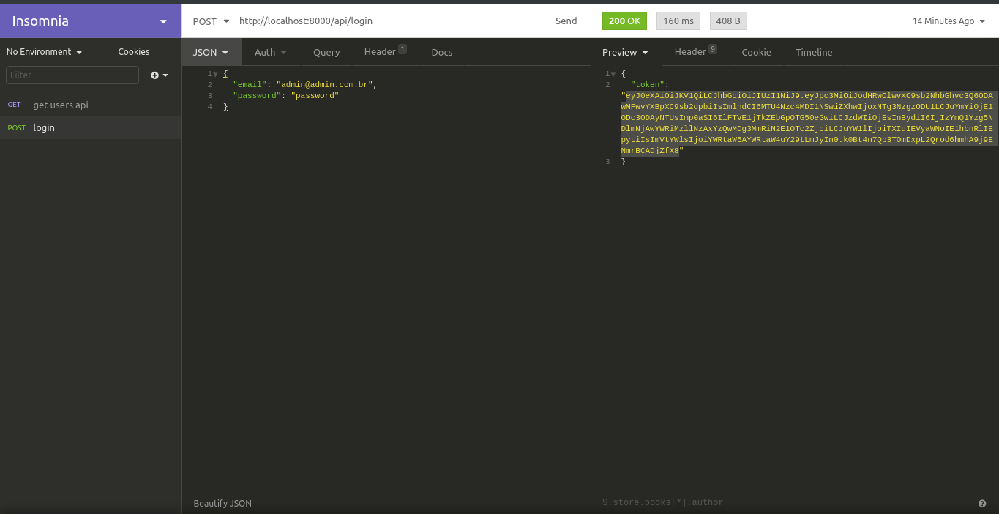
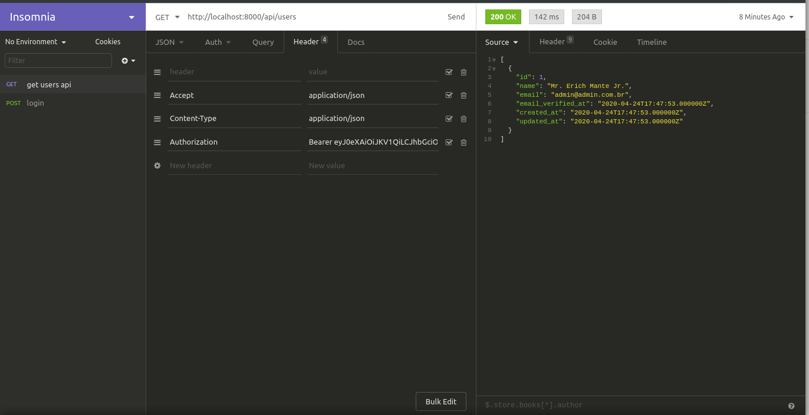
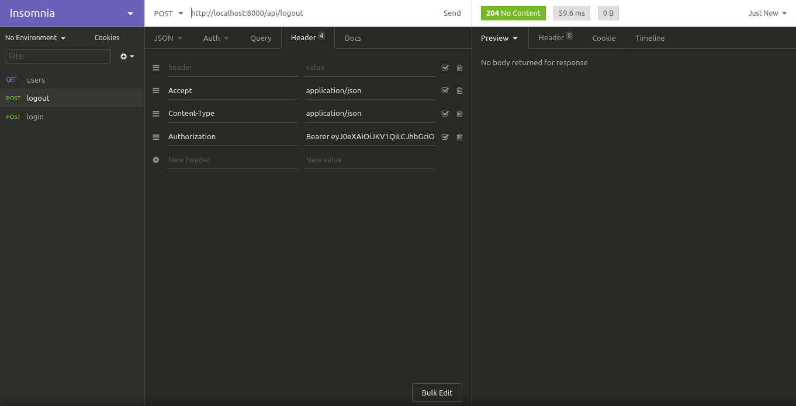
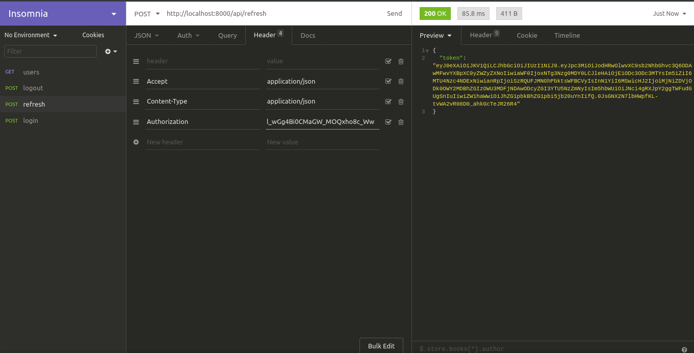

<p align="center"></p>

## API whit JWT

steps for using JWT whit authentication
```bash
composer require tymon/jwt-auth
```
in file config/auth.php change the driver for **jwt**
```bash
  'api' => [
            'driver' => 'jwt',
            'provider' => 'users',
            'hash' => false,
        ],
```
in mode of User implements this interface **JWTSubject** and add 2 functions in file
```bash
class User extends Authenticatable implements JWTSubject

     /**
     * @inheritDoc
     */
    public function getJWTIdentifier()
    {
        return $this->id;
    }

    /**
     * @inheritDoc
     */
    public function getJWTCustomClaims()
    {
        return [
            'name' => $this->name,
            'email' => $this->email
        ];
    }
```

generate a new token jwt with command
```bash
php artisan jwt:secret
```
in laravel 7.x is necessary to use the command bellow. 

```bash
composer require laravel/ui "^2.0"
```

make command 
```bash
php artisan migrate --seed
```

configuration routes for access the application in file routes/api.php
```bash
Route::post('login', 'Api\AuthController@login');

//token is necessary for access this route
Route::middleware('auth:api')->namespace('Api')->group(function () {
    Route::get('users', 'AuthController@users');
});
``` 

make a request using method http POST for login. In this case return a token case the can access information are correct case, otherwise return null.

i am be using insomnia for tests of API but your can use your favorite software for it 

create a json with email and password for user what will use in login.   

preview image e.g.



after you will make login the request return a token, you will use the token for create a new request where access a new route com HTTP GET for list all users, but this route is protected. You only can access that route with token   

example image of the user listing route



if you need revoke a token, use the logout route with HTTP POST   
to revoke you must be logged in

image preview e.g.




make a refresh token in you application   



```bash
//token is necessary for access this route
Route::middleware('auth:api')->namespace('Api')->group(function () {
    Route::get('users', 'AuthController@users');
    Route::post('logout','AuthController@logout');
});
```

enable the refresh token auto

create a function 
```bash
  protected function refresh(){
        $token = \Auth::guard('api')->refresh();
        return ['token' => $token];
    }
```
update the routes * routes has complete *

```bash
Route::post('login', 'Api\AuthController@login');

Route::post('refresh','Api\AuthController@refresh');

//token is necessary for access this route
Route::middleware(['auth:api','jwt.refresh'])->namespace('Api')->group(function () {
    Route::get('users', 'AuthController@users');
    Route::post('logout','AuthController@logout');
});

```


in file Kernel.php configure the **jwt.refresh** *(the last key of array)*
```bash
    protected $routeMiddleware = [
        'auth' => \App\Http\Middleware\Authenticate::class,
        'auth.basic' => \Illuminate\Auth\Middleware\AuthenticateWithBasicAuth::class,
        'bindings' => \Illuminate\Routing\Middleware\SubstituteBindings::class,
        'cache.headers' => \Illuminate\Http\Middleware\SetCacheHeaders::class,
        'can' => \Illuminate\Auth\Middleware\Authorize::class,
        'guest' => \App\Http\Middleware\RedirectIfAuthenticated::class,
        'password.confirm' => \Illuminate\Auth\Middleware\RequirePassword::class,
        'signed' => \Illuminate\Routing\Middleware\ValidateSignature::class,
        'throttle' => \Illuminate\Routing\Middleware\ThrottleRequests::class,
        'verified' => \Illuminate\Auth\Middleware\EnsureEmailIsVerified::class,
        'jwt.refresh' => RefreshToken::class,
    ];
```

in .env file set a time of refresh 
```bash
JWT_BLACLIST_GRACE_PERIOD=30
```
the route for refresh token automatic not is necessary logged 


## THE END
